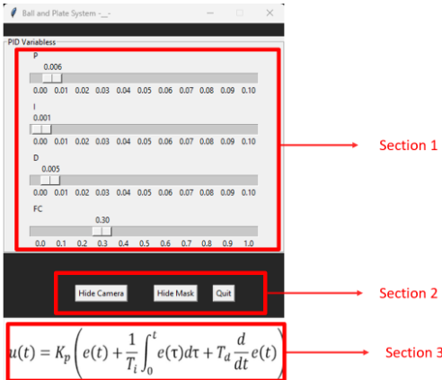
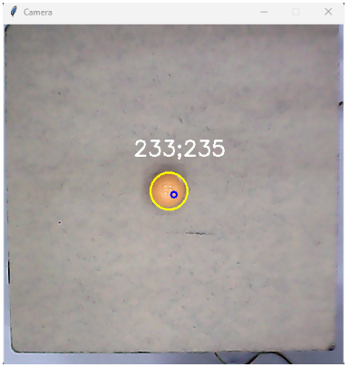
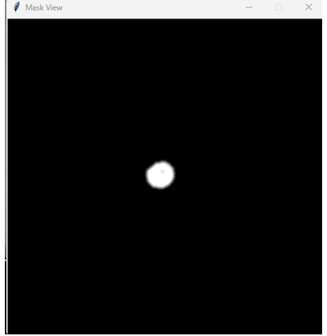

# Ball and Plate System - PID Control with Computer Vision

A real-time ball balancing system that uses computer vision to track a ball and PID control to balance it on a plate using servo motors.

---

## Screenshots

### 1. GUI Operator Window


### 2. Camera Window

*Shows the real-time camera feed with ball position tracking (yellow circle and coordinates overlay).*

### 3. Mask Window

*Displays the binary mask used for ball detection (white area is the detected ball).* 

---

## Project Overview

This system consists of two main components:
1. **Python Vision & GUI Application** (`ball_plate_vision_gui.py`) - Handles ball detection, PID control, and user interface
2. **Arduino Servo Controller** (`ball_plate_arduino.ino`) - Controls servo motors based on commands from Python

## Features

- **Real-time ball tracking** using HSV color filtering
- **PID control algorithm** for precise position control
- **Interactive GUI** with adjustable PID parameters
- **Multiple camera views** (main view, mask view for debugging)
- **Serial communication** between Python and Arduino
- **Configurable color detection** for different ball colors

## Hardware Requirements

### Arduino Setup
- Arduino board (Uno, Nano, Mega, etc.)
- 2x Servo motors (for X and Y axis control)
- USB cable for Arduino connection

### Servo Connections
- **X-axis servo**: Pin 9
- **Y-axis servo**: Pin 4
- **Power**: 5V supply
- **Ground**: Common ground

### Camera Setup
- USB webcam or built-in camera
- Good lighting conditions
- Ball with distinct color (yellow, green, or red)

## Software Requirements


### Arduino Libraries
- `Servo.h` (included with Arduino IDE)

## Installation and Setup

### 1. Arduino Setup
1. Open `ball_plate_arduino.ino` in Arduino IDE
2. Connect Arduino to your computer
3. Select the correct board and port
4. Upload the code to Arduino
5. Note the COM port number (e.g., COM8)

### 2. Python Setup
1. Install required Python packages
2. Update the COM port in `ball_plate_vision_gui.py`:
   ```python
   ser = serial.Serial('COM8', 9600)  # Change COM8 to your port
   ```
3. Create a `data.txt` file with calibration data (if needed)
4. Add an `image.jpeg` file for the GUI (optional)

### 3. Camera Calibration
1. Adjust HSV color ranges in the Python code for your ball color:
   ```python
   # Yellow ball (currently active)
   loweryellow = np.array([0, 20, 205])
   upperyellow = np.array([56, 255, 255])
   
   # Uncomment and adjust for other colors as needed
   ```

## Usage

### Starting the System
1. Ensure Arduino is connected and uploaded
2. Run the Python application:
   ```bash
   python ball_plate_vision_gui.py
   ```
3. The GUI will open with PID control sliders

### GUI Controls

#### PID Parameters
- **P (Proportional)**: Controls response speed (0-0.1)
- **I (Integral)**: Eliminates steady-state error (0-0.1)
- **D (Derivative)**: Reduces overshoot (0-0.1)
- **FC (Filter Coefficient)**: Smooths control output (0-1)

#### View Controls
- **Camera**: Toggle camera view window
- **Show Mask**: Toggle mask view for debugging ball detection
- **Leave**: Exit the application

### Tuning PID Parameters

1. **Start with P only**: Set I and D to 0, adjust P until the ball responds
2. **Add I term**: Increase I to eliminate steady-state error
3. **Add D term**: Increase D to reduce overshoot and oscillations
4. **Fine-tune**: Make small adjustments to all parameters

### Troubleshooting

#### Ball Not Detected
- Check lighting conditions
- Adjust HSV color ranges
- Use the "Show Mask" button to debug detection
- Ensure ball color is distinct from background

#### Servo Issues
- Verify servo connections (pins 9 and 4)
- Check power supply to servos
- Ensure Arduino is properly connected
- Verify COM port in Python code

#### Poor Control Performance
- Adjust PID parameters gradually
- Check for mechanical issues (loose connections, friction)
- Ensure camera is stable and focused
- Verify ball size is appropriate for detection

## File Structure

```
project_ball_plate/
├── ball_plate_vision_gui.py    # Main Python application
├── ball_plate_arduino.ino      # Arduino servo controller
├── data.txt                    # Calibration data (create if needed)
├── image.jpeg                  # GUI image (optional)
├── image1.png                  # GUI Operator Window screenshot
├── image2.png                  # Camera Window screenshot
├── image3.png                  # Mask Window screenshot
└── README.md                   # This file
```

## Technical Details

### PID Control Algorithm
The system uses a PID controller with the following components:
- **Proportional (P)**: Direct response to position error
- **Integral (I)**: Accumulates error over time
- **Derivative (D)**: Responds to rate of change of error
- **Filter**: Low-pass filter to smooth control outputs

### Vision Processing
1. **Color Detection**: HSV color space filtering
2. **Morphological Operations**: Noise reduction and object enhancement
3. **Contour Detection**: Find ball boundaries
4. **Position Calculation**: Calculate ball center coordinates

### Communication Protocol
- **Baud Rate**: 9600
- **Format**: "angleX,angleY\n" (e.g., "75,80\n")
- **Update Rate**: ~200 Hz (5ms intervals)

## Safety Notes

- Ensure servos are properly secured to prevent damage
- Keep hands clear of moving parts during operation
- Use appropriate power supply for servos
